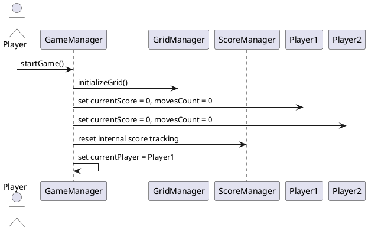
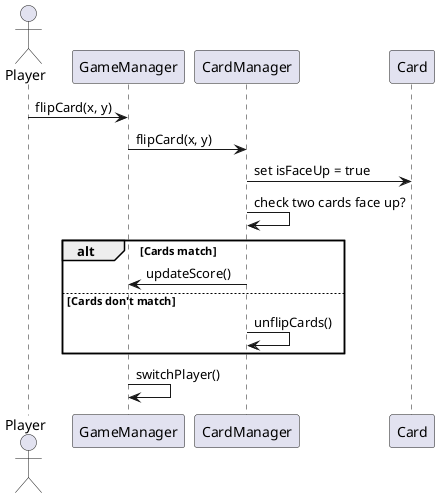
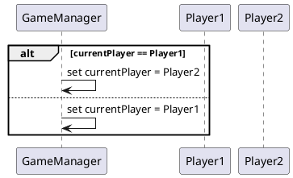
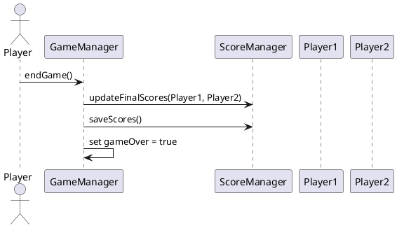

## Start new game:

#### Description:

Quand le jeu commence, GameManager reçoit la commande et appelle GridManager pour initialiser la grid du jeu. GameManager initialise les scores et le nombre de moves des deux joueurs à 0. Puis, GameManager définit le premier joueuer comme current player.

## Flipping a card:

#### Description:

Dans ce scenario, le premier joueuer (Player1) veut tourner une carte. GameManager prends la demande et demande à CardManager de tourner une carte. CardManager vérifie que 2 cartes sont tourner, et les compares si c'est le cas. Si les cartes sont les mêmes, on met à jour le score, et sinon, on retourne les 2 cartes. Finalement, GameManager change de joueur (Player2).

## Switch Player:

#### Description:

Lorsqu'on veut changer de joueuer, GameManager vérifie quel joueur est actuellement actif. Il met ensuite à jour currentPlayer pour passer à l’autre joueur, assurant ainsi la rotation des tours entre Player1 et Player2.
## End Game:

#### Description:

Lorsque la partie se termine, GameManager reçoit la commande de fin de partie. Il met à jour les scores finaux des joueurs via ScoreManager, puis sauvegarde ces scores. Ensuite, GameManager met à jour son état interne pour indiquer que la partie est terminée.