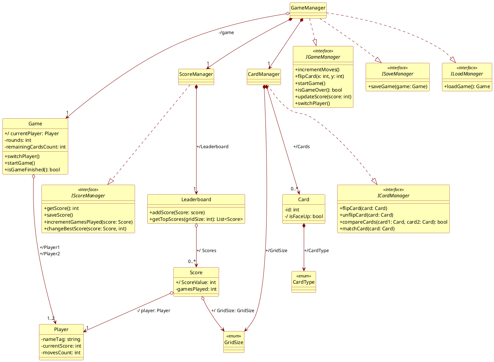

```plantuml
@startuml
hide circle
allowmixing
skinparam classAttributeIconSize 0
skinparam classBackgroundColor #ffffb9
skinparam classBorderColor #800000
skinparam classArrowColor #800000
skinparam classFontColor #black
skinparam classFontName Tahoma

' ---------------- CLASSES PRINCIPALES ----------------

class Player {
    - nameTag: string
    - currentScore: int
    - movesCount: int
}

class Score {
    +/ ScoreValue: int
    - gamesPlayed: int
}

Score o--> "1" Player : "-/ player: Player"
Score o--> GridSize : "+/ GridSize: GridSize"

class Leaderboard {
    + addScore(Score: score)
    + getTopScores(gridSize: int): List<Score>
}

Leaderboard o--> "0..*" Score : "+/ Scores"

class Game {
    +/ currentPlayer: Player
    - rounds: int
    - remainingCardsCount: int
    + switchPlayer()
    + startGame()
    + isGameFinished(): bool
}

Game  o--> "1..2" Player : "+/Player1\n+/Player2"

class Card {
    - id: int
    -/ isFaceUp: bool
}

Card *--> CardType : "+/CardType"

class CardType <<enum>>

' ---------------- INTERFACES ----------------

interface IGameManager  <<interface>> {
    + incrementMoves()
    + flipCard(x: int, y: int)
    + startGame()
    + isGameOver(): bool
	+ updateScore(score: int)
    + switchPlayer()
}

interface IScoreManager  <<interface>> {
    + getScore(): int
    + saveScore()
    + incrementGamesPlayed(score: Score)
    + changeBestScore(score: Score, int)
}


interface ICardManager  <<interface>> {
    + flipCard(card: Card)
	+ unflipCard(card: Card)
    + compareCards(card1: Card, card2: Card): bool
    + matchCard(card: Card)
}

interface ISaveManager  <<interface>> {
    + saveGame(game: Game)
}

interface ILoadManager <<interface>> {
    + loadGame(): Game
}

' ---------------- IMPLEMENTATIONS DES MANAGERS ----------------

class GameManager
GameManager ..|> IGameManager
GameManager ..|> ISaveManager
GameManager ..|> ILoadManager
GameManager o--> "1" Game : "-/game"
GameManager *--> "1" CardManager
GameManager *--> "1" ScoreManager

class ScoreManager
ScoreManager ..|> IScoreManager
ScoreManager *--> "1" Leaderboard : +/Leaderboard

class CardManager
CardManager ..|> ICardManager
CardManager *--> "0..*" Card : "+/Cards"
CardManager *--> GridSize : "+/GridSize"


enum GridSize <<enum>>

@enduml
```
Le diagramme présente