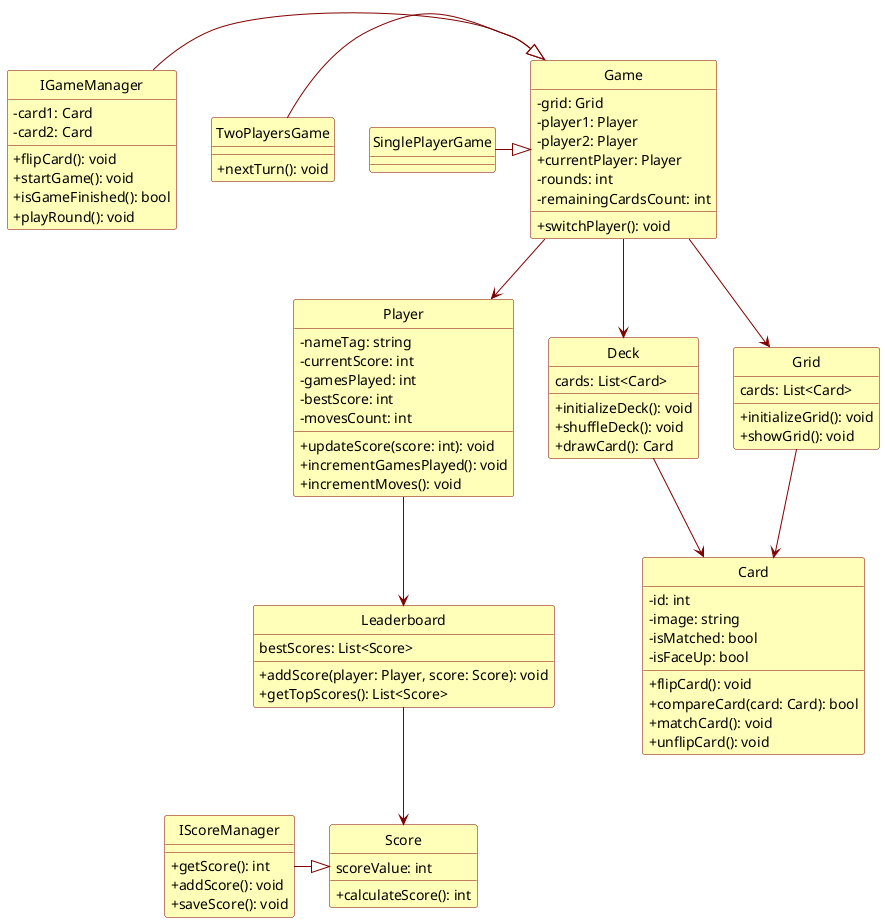

```plantuml
@startuml
hide circle
allowmixing
skinparam classAttributeIconSize 0
skinparam classBackgroundColor #ffffb9
skinparam classBorderColor #800000
skinparam classArrowColor #800000
skinparam classFontColor #black
skinparam classFontName Tahoma

' Classe Player
class Player {
    
- nameTag: string
- currentScore: int
- gamesPlayed: int
- bestScore: int
- movesCount: int
+ updateScore(score: int): void
+ incrementGamesPlayed(): void
+ incrementMoves(): void
}

' Classe Score
class Score {
    
scoreValue: int
+ calculateScore(): int
}

' Classe Leaderboard
class Leaderboard {
    
bestScores: List<Score>
+ addScore(player: Player, score: Score): void
+ getTopScores(): List<Score>
}
' Classe Deck (Paquet de cartes)
class Deck {
    
cards: List<Card>
+ initializeDeck(): void
+ shuffleDeck(): void
+ drawCard(): Card
}

' Classe Partie
class Game {
    
- grid: Grid
- player1: Player
- player2: Player
+ currentPlayer: Player
- rounds: int
- remainingCardsCount: int
+ switchPlayer(): void
}

' Classe IGameManager
class IGameManager {

- card1: Card
- card2: Card
+ flipCard(): void
+ startGame(): void
+ isGameFinished(): bool
+ playRound(): void
}

' Classe IScoreManager
class IScoreManager {

+ getScore(): int
+ addScore(): void
+ saveScore(): void 
}

' Classe PartieTwoPlayers héritant de Partie
class TwoPlayersGame {
    
+ nextTurn(): void
}

' Classe PartieSingleplayer héritant de Partie
class SinglePlayerGame {

}

' Classe Grille
class Grid {
    
cards: List<Card>
+ initializeGrid(): void
+ showGrid(): void
}

' Classe Carte
class Card {
    
- id: int
- image: string
- isMatched: bool
- isFaceUp: bool
+ flipCard(): void
+ compareCard(card: Card): bool
+ matchCard(): void
+ unflipCard(): void
}

' Relations
IGameManager  -|> Game
Game --> Player
Game --> Grid
TwoPlayersGame -|> Game
SinglePlayerGame -|> Game
Grid --> Card
IScoreManager  -|> Score
Leaderboard --> Score
Player --> Leaderboard
Game --> Deck
Deck --> Card
@enduml
```
