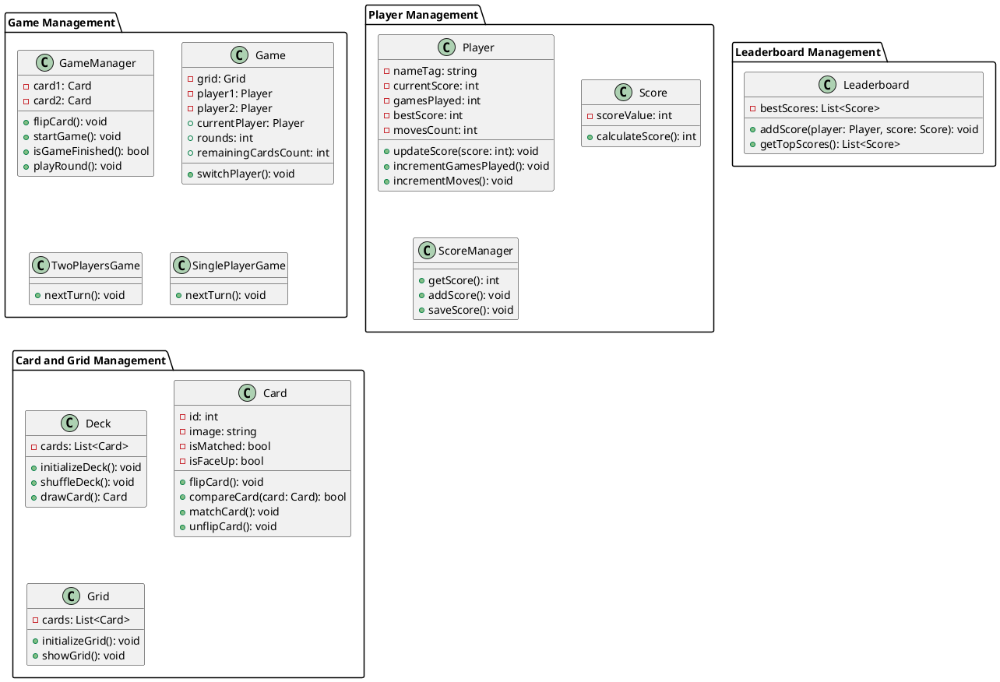

```plantuml
@startuml

package "Game Management" {
    class GameManager {
        -card1: Card
        -card2: Card
        +flipCard(): void
        +startGame(): void
        +isGameFinished(): bool
        +playRound(): void
    }
    
    class Game {
        -grid: Grid
        -player1: Player
        -player2: Player
        +currentPlayer: Player
        +rounds: int
        +remainingCardsCount: int
        +switchPlayer(): void
    }

    class TwoPlayersGame {
        +nextTurn(): void
    }

    class SinglePlayerGame {
        +nextTurn(): void
    }
}

package "Player Management" {
    class Player {
        -nameTag: string
        -currentScore: int
        -gamesPlayed: int
        -bestScore: int
        -movesCount: int
        +updateScore(score: int): void
        +incrementGamesPlayed(): void
        +incrementMoves(): void
    }

    class Score {
        -scoreValue: int
        +calculateScore(): int
    }

    class ScoreManager {
        +getScore(): int
        +addScore(): void
        +saveScore(): void
    }
}

package "Card and Grid Management" {
    class Deck {
        -cards: List<Card>
        +initializeDeck(): void
        +shuffleDeck(): void
        +drawCard(): Card
    }

    class Card {
        -id: int
        -image: string
        -isMatched: bool
        -isFaceUp: bool
        +flipCard(): void
        +compareCard(card: Card): bool
        +matchCard(): void
        +unflipCard(): void
    }

    class Grid {
        -cards: List<Card>
        +initializeGrid(): void
        +showGrid(): void
    }
}

package "Leaderboard Management" {
    class Leaderboard {
        -bestScores: List<Score>
        +addScore(player: Player, score: Score): void
        +getTopScores(): List<Score>
    }
}

@enduml
```
